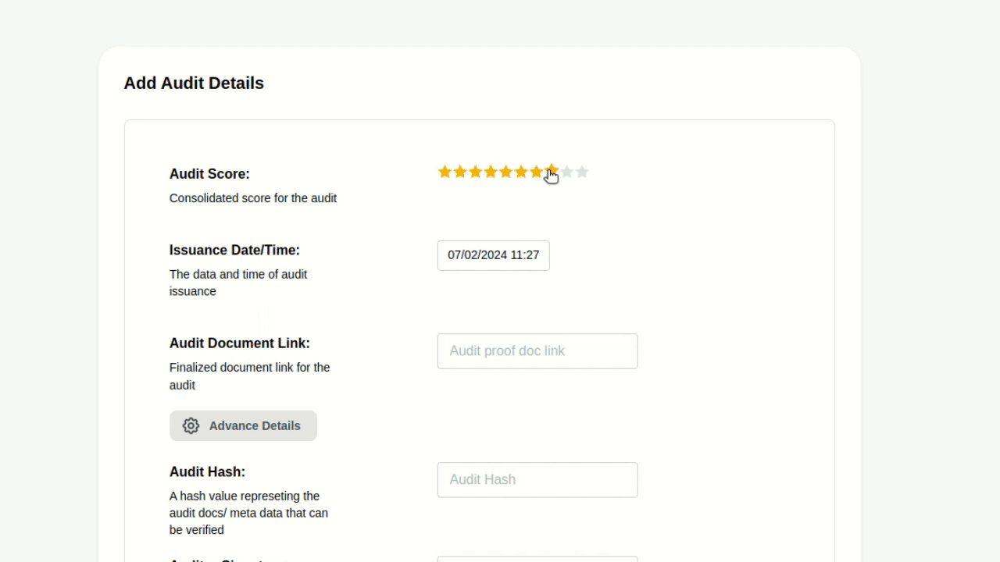

# Add Audit Attestations

ZenGuard providers the security assurance for the modules via onchain audit attestations provided by the auditors.
Auditors provide these audit attestations to the module via our dashboard which are embedded onchain on EAS and later used
to verify when a Safe user enables them on them Safe Account.

Auditors have to follow only few steps to attest the module.

1. Verify their account on the Dashboard (https://dashboard.zenguard.xyz)
2. Naviagate to the desired module and find their info - onchain deployment, code base, application etc.
3. They can then can perform the audits. Once the audit is completed they can add the audit details as attestation for the partical module.

The audit attesation follows the [ERC-7512](https://github.com/ethereum/ercs/blob/master/ERCS/erc-7512.md) standard. Here is a detailed post on how we leverage this ERC: https://7512.zenguard.xyz

Once the module is attested the audit details will be available on ZenGuard Module [Marktetplace](https://explore.zenguard.xyz).

Here is a quick demo of the module audit attestation flow.

